# 首页功能介绍：

登录进入首页


1.项目管理：创建新项目和打开已有项目入口

2.用户管理：对项目管理员进行操作

3.角色管理：对项目角色进行操作

4.模板：用于数据模型生成代码，设置每个节点的模板内容，系统根据模板生成相应的java代码。


| 属性     | 描述                                                  | 必填 | 注意点            |
| -------- | ----------------------------------------------------- | ---- | ----------------- |
| 模板名称 | 模板的名称                                            | 是   |                   |
| 作用框架 | 用于哪个持久层框架                                    | 是   | 目前只支持Mybatis |
| 项目类型 | 默认后台                                              | 是   |                   |
| 节点类型 | model、example、dao、service、serviceImpl、controller | 是   |                   |
| 内容     | 模板内容                                              | 是   | FrameMark语法     |


5.计划：用于数据模型生成文件，设置数据模型要生成的节点，系统根据计划去生成java相关文件。


| 属性     | 描述               | 必填 | 注意点            |
| -------- | ------------------ | ---- | ----------------- |
| 名称     | 计划的名称         | 是   |                   |
| 作用框架 | 用于哪个持久层框架 | 是   | 目前只支持Mybatis |
| 节点配置 | [参照节点配置表]() |      |                   |

6.资源管理：平台菜单管理

7.授权管理：平台菜单授权管理

8.首页介绍：


# 1. 初始化数据库

打开客户端安装目录文件：

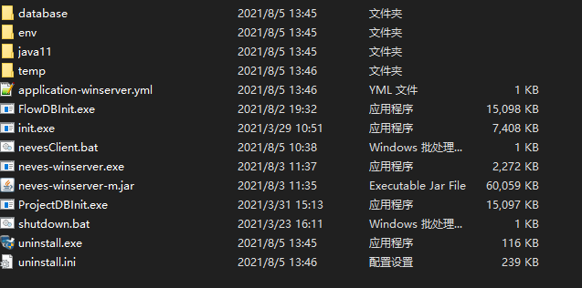

## 1.1项目数据库

在客户端目录文件下双击 ProjectDBInit.exe程序进入项目数据库初始化

1.mySql和sqlServer数据无需手动创建数据库，可以直接初始化界面的数据库连接中填写数据库名称如下图

2.oracle数据库需要自己先创建用户，此处不做示范操作

4.用户和密码是你本地数据库的用户和密码

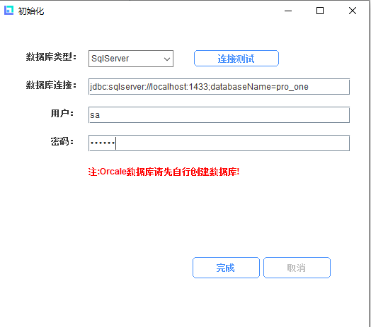

填写完数据库信息 可以点击连接测试，测试成功点击完成并确认初始化数据库

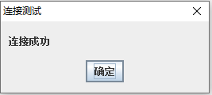  

## 1.2流程数据库

在客户端目录文件下双击 FlowDBInit.exe程序进入项目数据库初始化

1.mySql和sqlServer数据无需手动创建数据库，可以直接初始化界面的数据库连接中填写数据库名称如下图

2.oracle数据库需要自己先创建用户，此处不做示范操作

4.用户和密码是你本地数据库的用户和密码

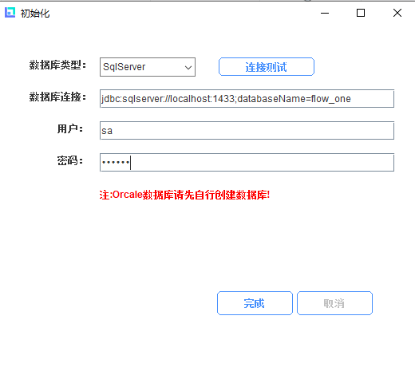

填写完数据库信息 可以点击连接测试，测试成功点击完成并确认初始化数据库

  

# 2. 创建新项目

进入客户端首页，在添加新项目弹窗内手动添加项目名称、项目版本、勾选前台(默认框架vue)、后台(默认MyBatis)，插件按个人需求勾选，填写完毕保存创建完项目后进入项目。


| 属性       | 描述                           | 必填 | 注意点                     |
| ---------- | ------------------------------ | ---- | -------------------------- |
| 项目名称   | 要创建的项目名称               | 是   | 建议使用英文               |
| 项目版本   | 标记版本迭代                   | 否   |                            |
| 管理员     | 设置项目的管理员，用于分配权限 | 是   |                            |
| 持久层框架 | 目前只支持Mybatis              | 是   |                            |
| 插件       | 代码中用到的第三方的辅助工具   | 否   |                            |
| 默认计划   | 项目中默认启用的计划           | 是   | 创建数据模型时可以手动更改 |

## 2.1 创建前端项目

进入项目后显示操作主页，之后进行前后端项目的初始化操作

个人配置可以设置某个开发人员的独有配置，开发人员第一次进入项目前会先设置个人配置，之后使用过程中可以随时进行修改。


### 2.1.1 使用新建项目
个人提前部署前端项目文件夹位置，在项目路径中填入文件夹位置，保存后提示是否初始化项目，点击确认。

<h5>使用新项目时，无需启动使用已有项目按钮。</h5>


后待前端项目文件初始化完毕解压node_modules压缩包到node_modules文件夹


前台项目采用网关路由的方式调用后台接口，请根据自己情况进行配置项目config下面的index.js中的接口属性


### 2.1.2 使用已有项目

<h5>使用已有项目时，需启动使用已有项目按钮。</h5>
使用已有项目，填入项目路径位置，完善服务地址，保存项目


## 2.2 创建后端项目

### 2.2.1 使用新建项目

<h5>使用新项目时，无需启动使用已有项目按钮。</h5>
同前端项目部署文件夹位置，填入项目路径，服务地址后保存初始化后端项目。

| 属性         | 描述                                                         | 必填 | 注意点 |
| ------------ | ------------------------------------------------------------ | ---- | ------ |
| 项目路径     | 开发人员本地的项目路径                                       | 是   |        |
| 使用已有项目 | 如果开启，会生成系统自带的项目，并覆盖当前项目路径下的所有文件 | 是   |        |
| 服务地址     | 用于测试后端接口                                             | 是   |        |
| 默认计划     | 设置个人的默认计划，具体可参照[计划]()                       | 是   |        |
| 作者         | 用于标识开发代码的作者                                       | 是   |        |


### 2.2.2 使用已有项目

<h5>使用已有项目时，需启动使用已有项目按钮。</h5>
使用已有项目，填入项目路径位置，完善服务地址，保存项目


## 2.3 后端项目

打开后端项目

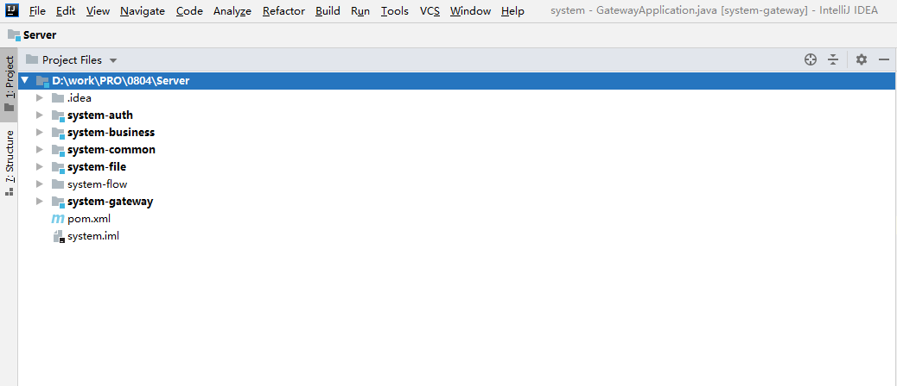

### 2.3.1 redis nacos的安装和maven的配置

redis nacos在Neves_client\env安装的目录下面
若使用平台创建的项目请解压redis nacos软件进行使用，nacos作为注册中心使用，

<h4>请启动redis、nacos</h4>

### 2.3.2 system-auth层

项目鉴权服务，包含用户管理、权限管理、数据源管理等等。

配置项目数据源例如中配置,此示例数据库使用sqlserver，即此处更改对应数据库sqlserve，如使用其他数据库请做适当更改，更改目的数据库为菜单1.1处所初始化的数据库名称
	
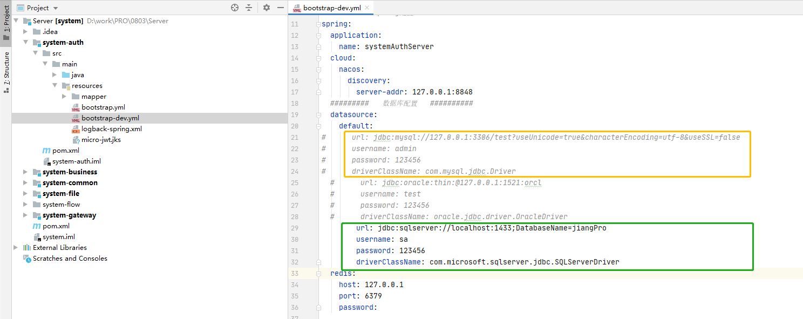

redis密码配置：如没有redis密码即可删除，有即更改redis密码

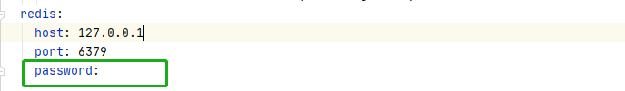

### 2.3.3 system-business层

业务层服务

配置的数据源是创建后台项目时你自己添加的数据源，此示例数据库使用sqlserver，即此处更改对应数据库sqlserve，如使用其他数据库请做适当更改，更改目的为菜单1.1所初始化的数据库

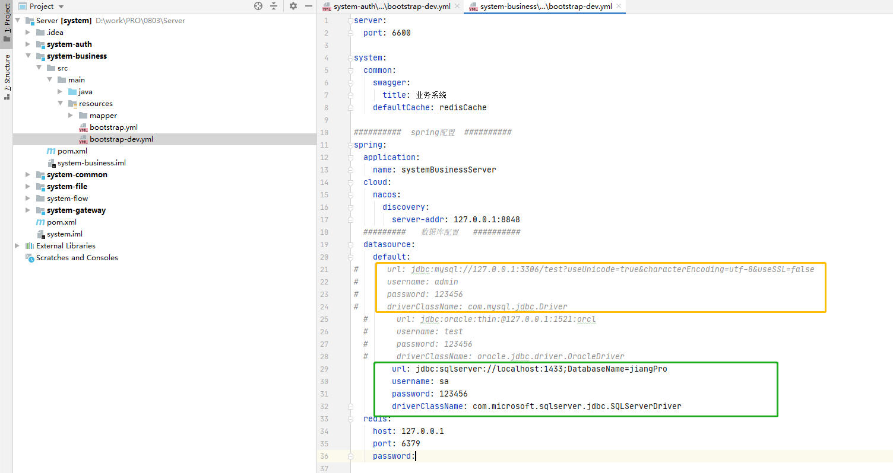

### 2.3.4 system-common

包含一些公共工具，插件等服务

### 2.3.5 system-file

文件的存储，上传下载的一些文件服务

### 2.3.6 system-flow层

流程创建后的流程相关后台服务

请修改application-design.yml和application-flowable.yml配置文件的数据源信息

此处所更改的数据库名称为流程初始化的数据库，此示例数据库使用sqlserver，即此处更改对应数据库sqlserve，如使用其他数据库请做适当更改，更改目的为菜单1.2所初始化的流程数据库名称

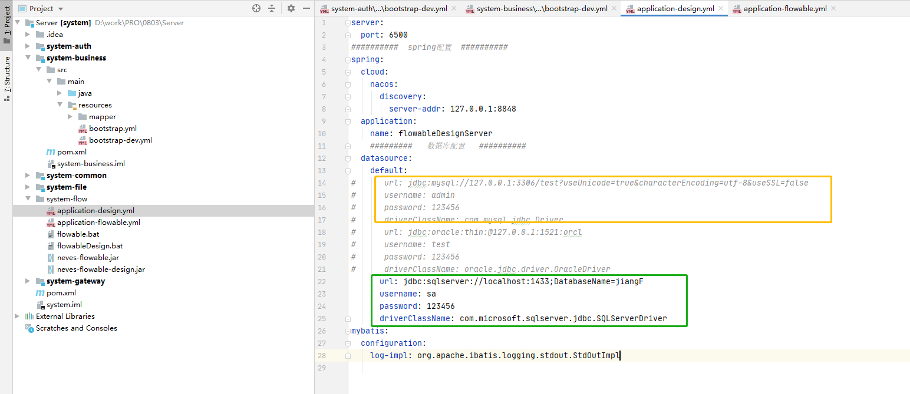
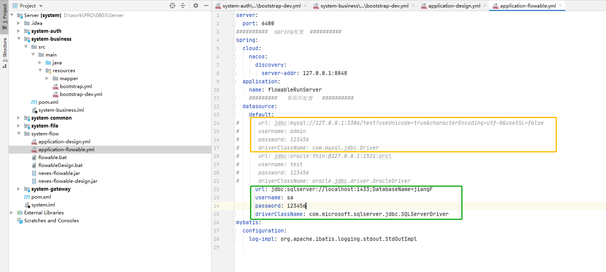

### 2.3.7 system-gateway层

服务网关功能服务，由前台请求到网关路由层，根据服务名称和接口请求路径自动转发到各自的服务接口

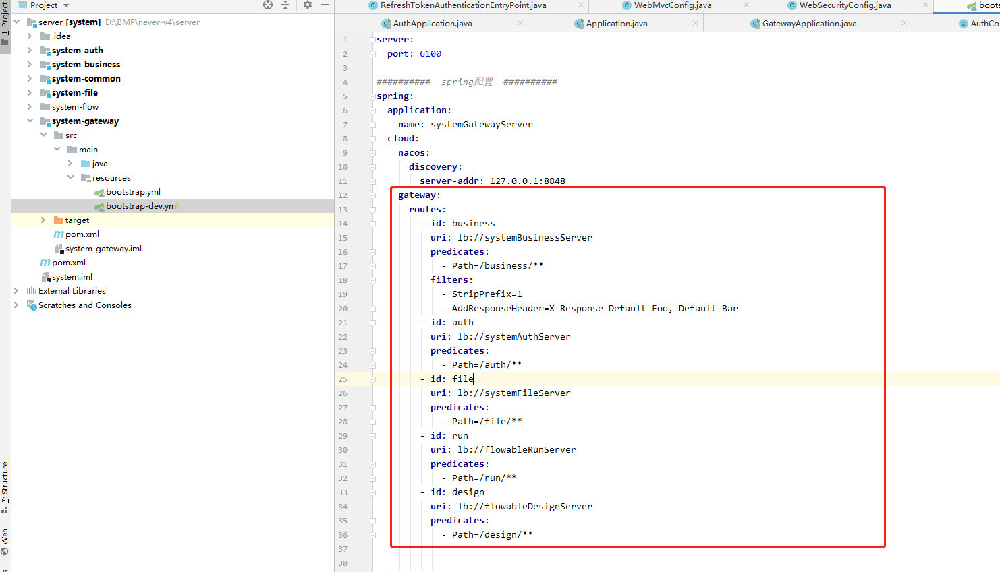

# 3.启动项目

## 3.1 后端项目

后端项目启动五个服务文件：
1. system-auth层：/src/main/java/com.system.auth.server/AuthApplication
2. system-business层：/src/main/java/com.business/Application
3. system-flow层：flowable.bat,flowableDesign.bat
右击文件点击Open in Terminal,如图输入对应文件名回车

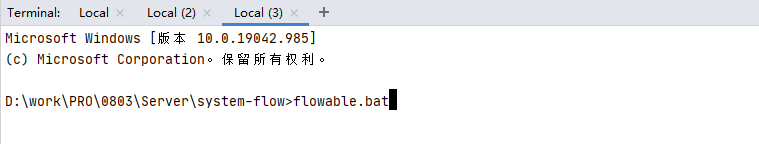
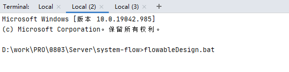

4. system-gateway层：/src/main/java/com.system.getaway.server/AuthApplication

## 3.2前端项目

使用vscode打开前端项目并在终端运行启动运行指令

```
npm run dev
```

启动成功访问地址

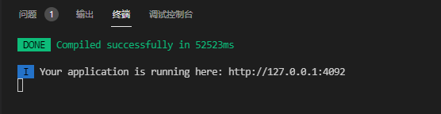

## 3.3 进入项目

项目登录默认:
账户：admin 
密码：123456

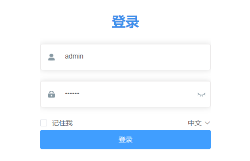

项目运行成功后登录主页面，后续进行个人开发，详情操作展示可参考demo项目手册

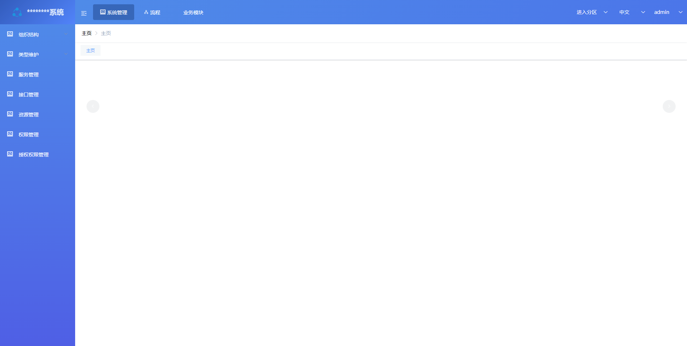


