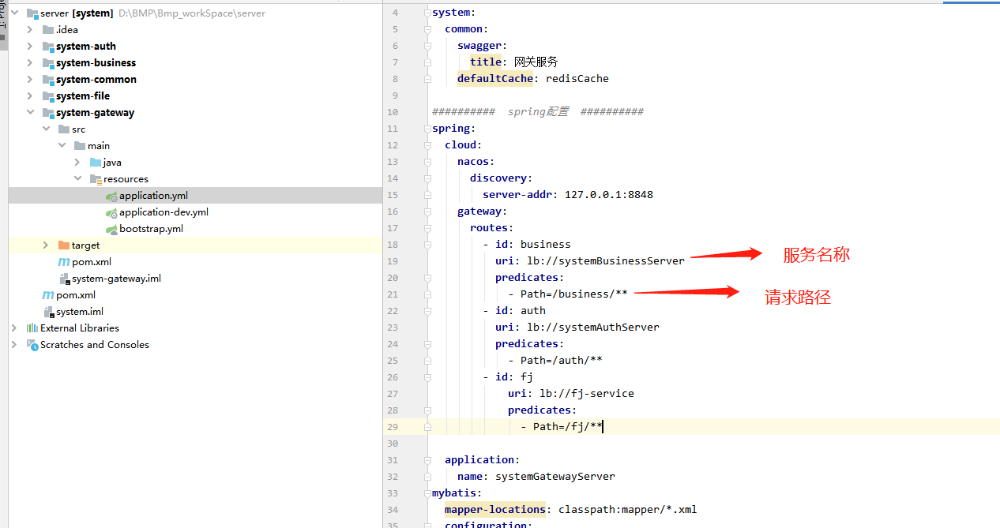

# 一. 前台项目操作示例

根据前端设计器创建好列表和表单页面后，前端项目运行页面中添加列表页，在资源管理目录的基础模块引入列表页面，其中扩展属性：

路径：页面运行时浏览器地址栏路径

组件路径：页面跳转时所在项目中的相对路径，默认生成src/views/基础目录

项目操作列表页

## 1. 引入创建的接口js并修改

## 2. 修改请求列表内的请求后台的方法 默认将getProjectList修改成接口js中的pageList

## 3. 采用设计器编写的列表和表单为例，以打开子组件方法的形式打开表单
### 3.1 引入表单组件注册并使用

添加/business路径

### 3.2 表单引入api

## 3.2 以列表数据的添加、修改、删除、查询为示例

在表格操作单元中加入删除、编辑按钮

### 3.2.1数据的添加和修改

列表写入打开表单方法，传入对应参数-表单类型、表单标题、表单初始化数据

添加按钮打开

编辑按钮打开

表单对应方法

填写表单数据或编辑表单数据并在表单内使用对应api写入对应方法

### 3.2.2数据的删除

调用删除api写入删除方法

### 3.2.3数据搜索

列表中引入pageList搜索api

搜索条件绑定字段keyword

拷贝搜索字段并在列表数据请求方法中更换对应api

# 二. 后台项目操作示例
根据后端项目初始化后
## 1. 运行后端项目

### 1.2后端项目运行和配置

如果使用非平台创建项目请忽略以下步骤

#### 1.2.1 初始化项目的数据源

进入Neves_client安装的目录下面，​双击ProjectDBInitc初始化项目的数据源头

#### 1.2.2 redis nacos minio的安装和maven的配置

redis nacos minio在Neves_client\env安装的目录下面
若使用平台创建的项目请解压redis nacos minio软件进行使用，nacos作为注册中心使用，minio作为文件服务器使用

maven配置

#### 1.2.3 system-auth层

配置项目数据源例如中配置
	

#### 1.2.4 system-business层

配置的数据源是创建创建后台项目时你自己添加的数据源 

添加筛选逻辑

#### 1.2.5 system-file层

如果本地开发可不进行修改

#### 1.2.6 system-gateway层

前台请求到网关路由层，根据服务名称和接口请求路径自动转发到各自的服务接口

