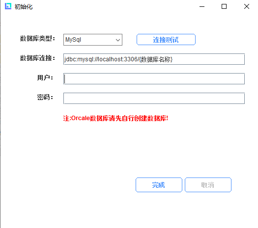
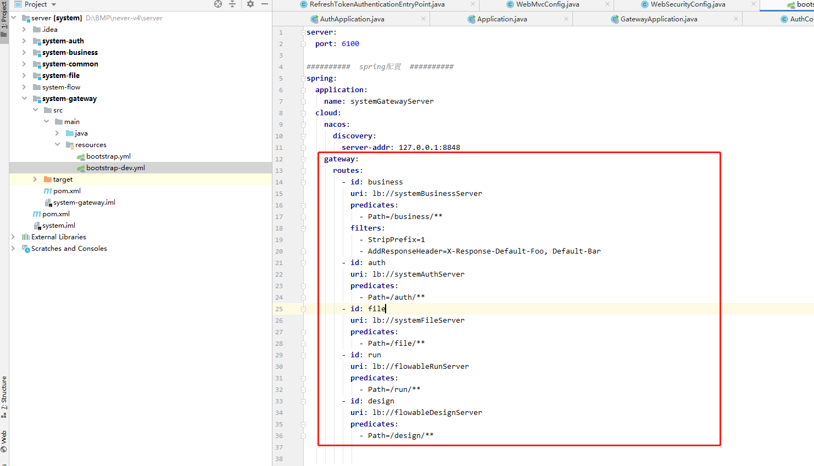

# 一. 前台项目操作示例

根据前端设计器创建好列表和表单页面后，前端项目运行页面中添加列表页，在资源管理目录的基础模块引入列表页面，其中扩展属性：

路径：页面运行时浏览器地址栏路径

组件路径：页面跳转时所在项目中的相对路径，默认生成src/views/基础目录

项目操作列表页

## 1. 引入创建的接口js并修改

## 2. 修改请求列表内的请求后台的方法 默认将getProjectList修改成接口js中的pageList

## 3. 采用设计器编写的列表和表单为例，以打开子组件方法的形式打开表单
### 3.1 引入表单组件注册并使用

添加/business路径

### 3.2 表单引入api

## 4. 以列表数据的添加、修改、删除、查询为示例

在表格操作单元中加入删除、编辑按钮

### 4.1数据的添加和修改

列表写入打开表单方法，传入对应参数-表单类型、表单标题、表单初始化数据

添加按钮打开

编辑按钮打开

表单对应方法

填写表单数据或编辑表单数据并在表单内使用对应api写入对应方法

### 4.2数据的删除

调用删除api写入删除方法

### 4.3数据搜索

列表中引入pageList搜索api

搜索条件绑定字段keyword

拷贝搜索字段并在列表数据请求方法中更换对应api

# 三. 流程操作示例

## 1. 创建流程表单

在前端设计器创建流程表单后，修改如下配置

配置表单的中的流程key

绑定表单的主键id和提交意见的字段名（字段名在formdata中即可，不需要实体字段）

修改表单的保存更新方法为你自己表单的接口方法

使用流程表单请使用路由打开表单的形式

配置路由

## 2.创建流程示列

在流程设计器中开发-模型管理中设计流程，创建流程图，填写相关属性

该实列创建基本的流程作演示使用

单击空白处挂载表单路由的path，和其他相关信息

单击第一个任务节点信息修改添加相关信息

单击最后一个任务节点信息和第一个的区别是处理命令不同

保存流程图，并导出流程图

启动项目后在导入流程图，并发布流程就可以正常处理流程业务了

# 三. 后台项目操作示例
根据后端项目初始化后
## 1. 运行后端项目

### 1.2后端项目运行和配置

如果使用非平台创建项目请忽略以下步骤

#### 1.2.1 初始化项目的数据源

进入Neves_client安装的目录下面，​双击ProjectDBInit初始化项目的数据源

#### 1.2.2 初始化流程的数据源

进入Neves_client安装的目录下面，​双击FlowDBInit初始化流程的数据源

#### 1.2.3 redis nacos minio的安装和maven的配置

redis nacos minio在Neves_client\env安装的目录下面
若使用平台创建的项目请解压redis nacos minio软件进行使用，nacos作为注册中心使用，minio作为文件服务器使用
请启动redis, nacos, minio

maven配置

#### 1.2.4 system-auth层

配置项目数据源例如中配置
	

#### 1.2.5 system-business层

配置的数据源是创建创建后台项目时你自己添加的数据源 

添加关键字查询逻辑

#### 1.2.6 system-flow层

请修改application-design.yml和application-flowable.yml配置文件的数据源信息

#### 1.2.7 system-gateway层

前台请求到网关路由层，根据服务名称和接口请求路径自动转发到各自的服务接口

#### 1.2.8  项目启动
请启动每一层得服务，流程的是bat启动文件的形式启动

