# 使用步骤
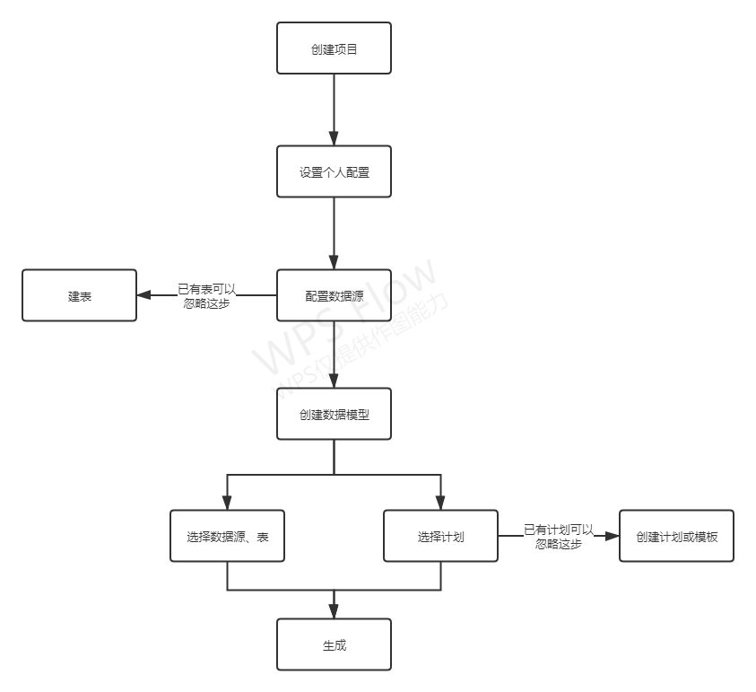

# 创建项目
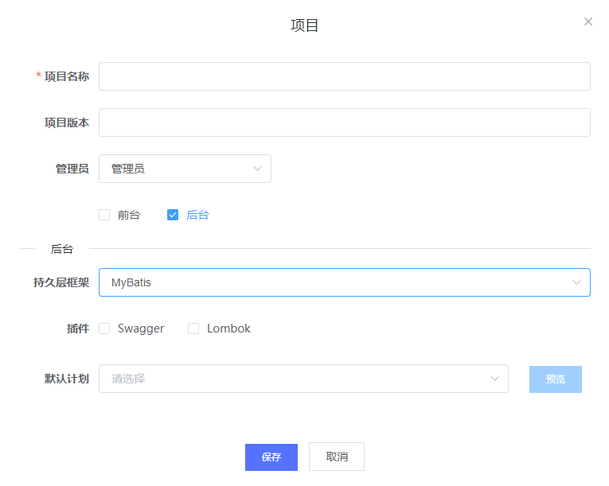

| 属性       | 描述                           | 必填 | 注意点                     |
| ---------- | ------------------------------ | ---- | -------------------------- |
| 项目名称   | 要创建的项目名称               | 是   | 建议使用英文               |
| 项目版本   | 标记版本迭代                   | 否   |                            |
| 管理员     | 设置项目的管理员，用于分配权限 | 是   |                            |
| 持久层框架 | 目前只支持Mybatis              | 是   |                            |
| 插件       | 代码中用到的第三方的辅助工具   | 否   |                            |
| 默认计划   | 项目中默认启用的计划           | 是   | 创建数据模型时可以手动更改 |

# 模板

用于数据模型生成代码，设置每个节点的模板内容，系统根据模板生成相应的java代码。
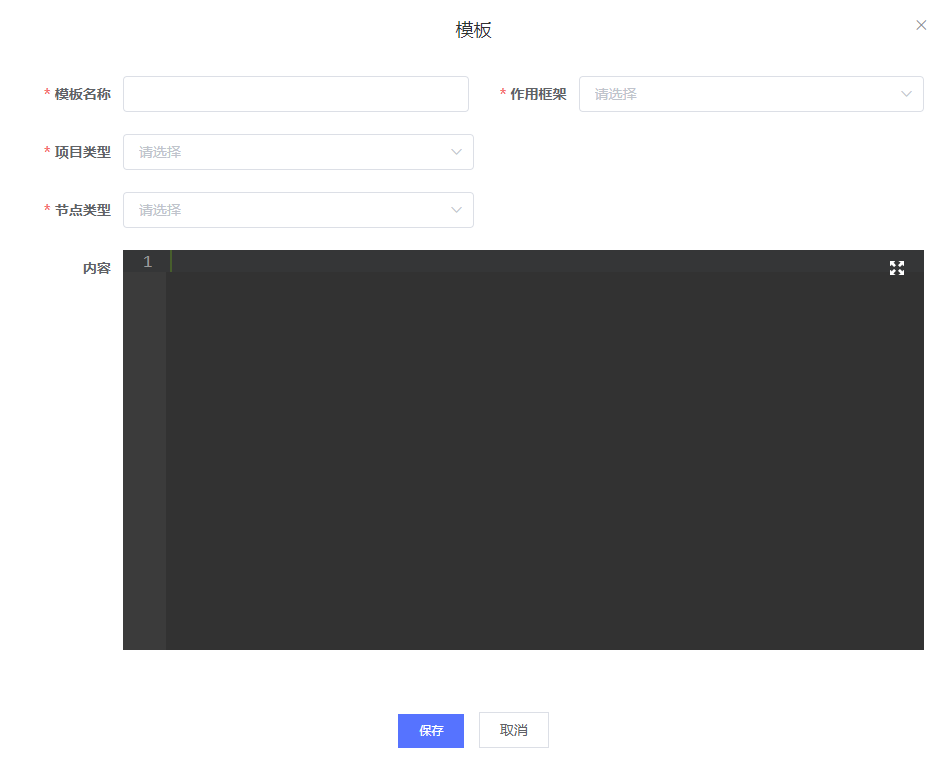

| 属性     | 描述                                                  | 必填 | 注意点            |
| -------- | ----------------------------------------------------- | ---- | ----------------- |
| 模板名称 | 模板的名称                                            | 是   |                   |
| 作用框架 | 用于哪个持久层框架                                    | 是   | 目前只支持Mybatis |
| 项目类型 | 默认后台                                              | 是   |                   |
| 节点类型 | model、example、dao、service、serviceImpl、controller | 是   |                   |
| 内容     | 模板内容                                              | 是   | FrameMark语法     |

# 计划

用于数据模型生成文件，设置数据模型要生成的节点，系统根据计划去生成java相关文件。
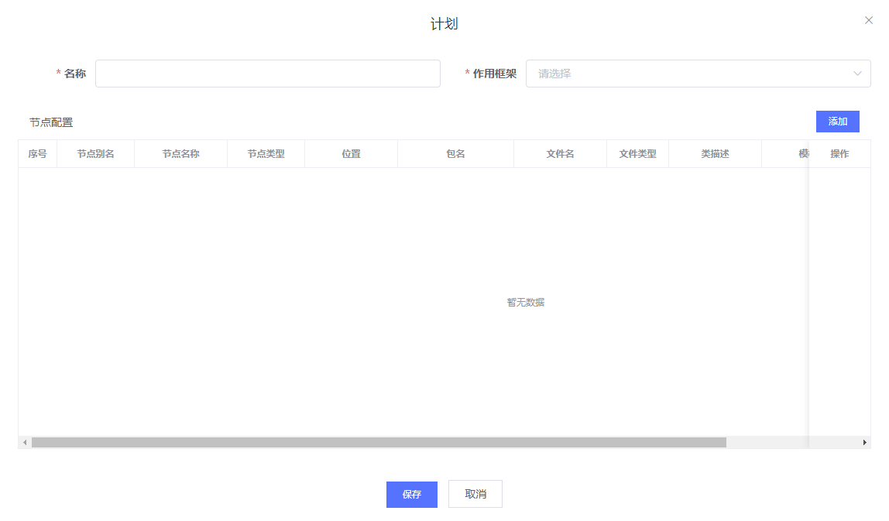

| 属性     | 描述               | 必填 | 注意点            |
| -------- | ------------------ | ---- | ----------------- |
| 名称     | 计划的名称         | 是   |                   |
| 作用框架 | 用于哪个持久层框架 | 是   | 目前只支持Mybatis |
| 节点配置 | [参照节点配置表]() |      |                   |

### 节点配置表

| 属性     | 描述                                                  | 必填 | 注意点           |
| -------- | ----------------------------------------------------- | ---- | ---------------- |
| 节点类型 | model、example、dao、service、serviceImpl、controller | 是   | 只能输入英文     |
| 节点别名 | 用于编写模板时使用的别名                              | 是   | 只能输入英文     |
| 节点名称 | 用于在数据模型树展示的名称                            | 是   |                  |
| 位置     | 默认src/main/java                                     | 是   | 特殊情况可以修改 |
| 包名     | java文件的包名                                        | 是   |                  |
| 文件名   | java文件的文件名（类名）                              | 是   |                  |
| 文件类型 | java、xml（mybatis的映射文件）                        | 是   |                  |
| 类描述   | 类的描述                                              |      |                  |
| 模板     | 使用什么模板生成                                      | 是   |                  |
| 执行类   | 使用什么执行器生成代码                                | 是   | 可以自定义执行器 |

# 成员

可以设置项目的开发人员，设置前除了创建者和管理员是看不到项目的，设置完后成员可以看到

# 数据源

配置连接数据库信息，目前支持MySql、Oracle、SqlServer

注：只能连接系统部署的所在服务器能访问范围内的数据库。

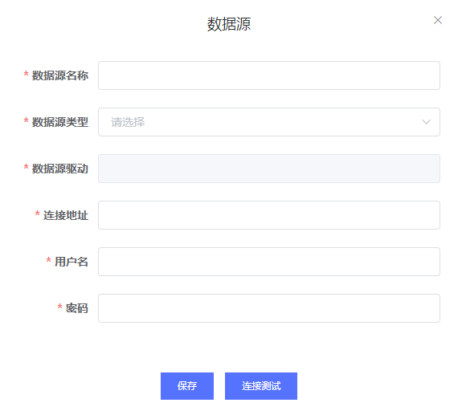

| 属性       | 描述                         | 必填 | 注意点     |
| ---------- | ---------------------------- | ---- | ---------- |
| 数据源名称 | 数据源的名称                 | 是   | 只用于标识 |
| 数据源类型 | MySql、Oracle、SqlServer     | 是   |            |
| 数据源驱动 | 连接各个数据库所使用的驱动包 | 是   |            |
| 连接地址   | 连接各个数据库的连接地址     | 是   |            |
| 用户名     | 数据库用户名                 | 是   |            |
| 密码       | 数据库密码                   | 是   |            |

## 表

对数据库的表进行新建、修改、删除操作。

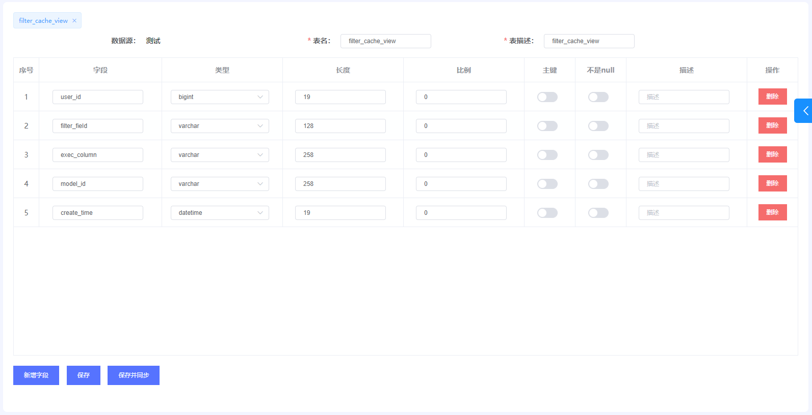

| 属性   | 描述       | 必填 | 注意点 |
| ------ | ---------- | ---- | ------ |
| 表名   | 表名       | 是   |        |
| 表描述 | 对表的描述 | 是   |        |

## 字段

对数据表的字段进行添加、修改、删除操作。

| 属性     | 描述       | 必填 | 注意点                 |
| -------- | ---------- | ---- | ---------------------- |
| 字段     | 字段名     | 是   | 根据各数据库的规则命名 |
| 类型     | 字段类型   | 是   |                        |
| 长度     | 字段长度   | 是   |                        |
| 比例     | 字段比例   | 否   |                        |
| 主键     | 是否是主键 | 否   |                        |
| 不是null | 是否不为空 | 否   |                        |
| 描述     | 字段描述   | 否   |                        |

【保存】：只是更改数据库

【保存并同步】：除了更改数据库，实体类和mapper映射也会同步更改

# 模块

类似文件的作用。

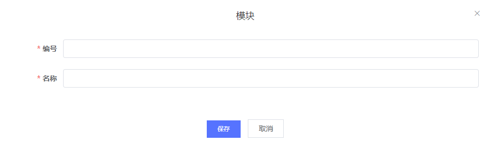

| 属性 | 描述     | 必填 | 注意点       |
| ---- | -------- | ---- | ------------ |
| 编号 | 模块编号 | 是   | 只能输入英文 |
| 名称 | 模块名称 | 是   |              |

# 数据模型

数据模型是整个系统的核心，上面所有的功能都是为了数据模型的生成而准备的。通过数据表、模板和计划3方协助来完成。

| 属性   | 描述                                                         | 必填 | 注意点       |
| ------ | ------------------------------------------------------------ | ---- | ------------ |
| 类型   | 分为实体模型和非实体模型。实体模型是基于数据表、模板和计划生成，非实体模型只基于模板和计划生成 | 是   |              |
| 数据源 | 选择所添加的数据源                                           | 是   |              |
| 数据表 | 选择数据源下的数据表                                         | 是   |              |
| 编号   | 数据模型编号                                                 | 是   | 只能输入英文 |
| 名称   | 数据模型名称                                                 | 是   |              |
| 计划   | 生成数据模型所使用的计划                                     | 是   |              |

### 自定义配置

有些数据模型可能会有特殊情况，所以可以对原有的生成计划进行自定义。

自定义参数：用于模板生成代码时传入的自定义参数

编辑内容：[参照计划的节点配置表](节点配置表)

### 节点详解

#### model

实体类

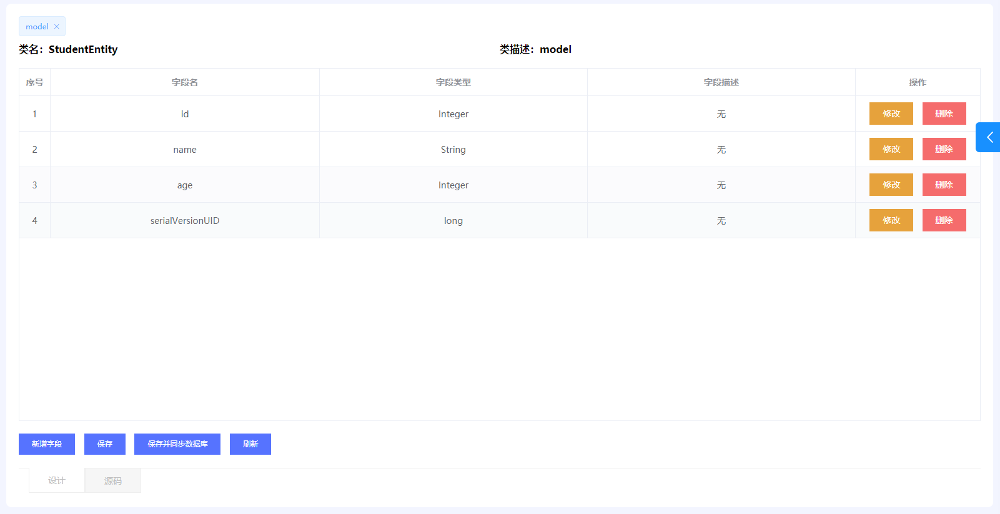
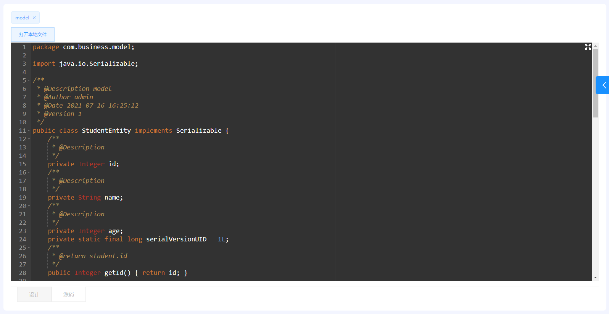

【保存】：只是更改实体类文件

【保存并同步】：除了更改实体类文件，数据库和mapper映射也会同步更改

#### example

mybatis的函数文件

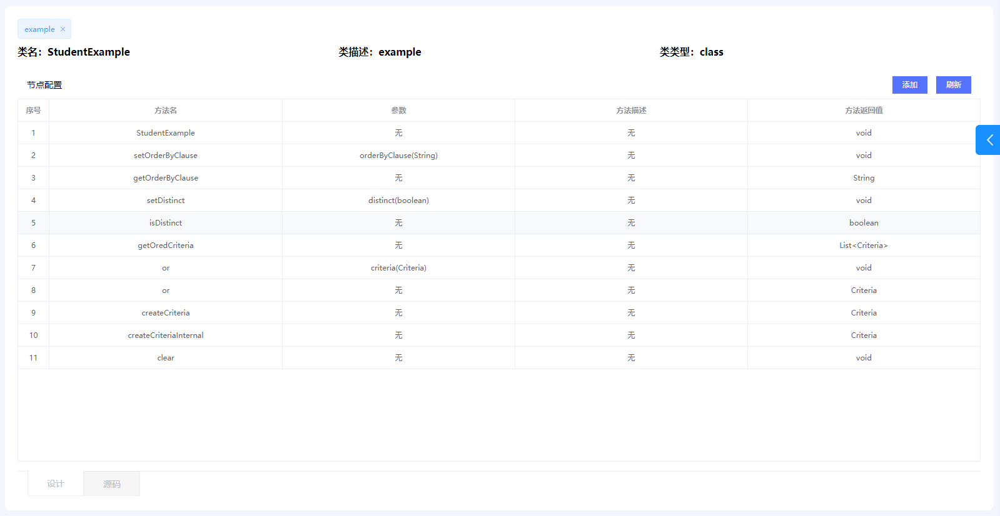
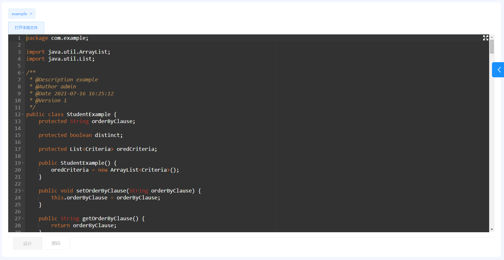

新增example方法

	
	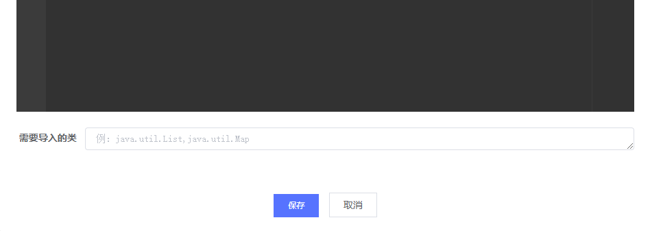

#### dao

数据库映射接口

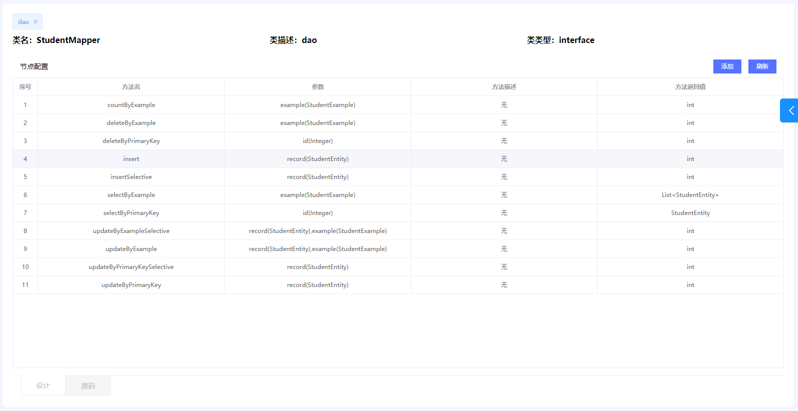
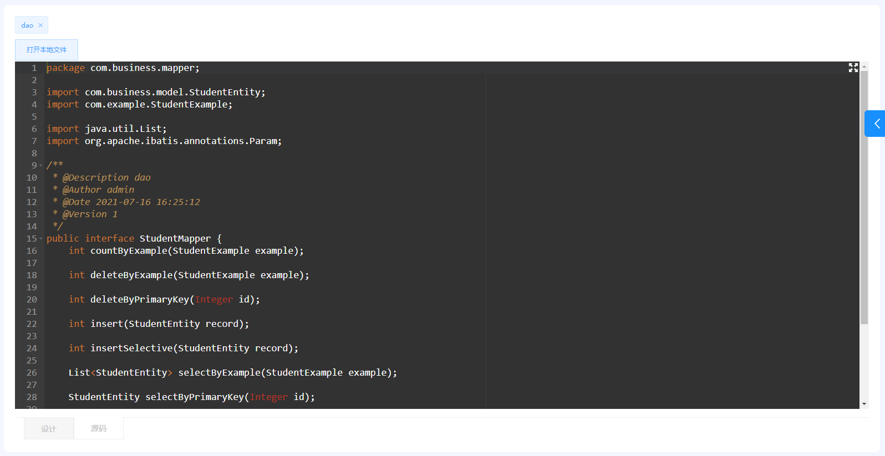

新增dao接口

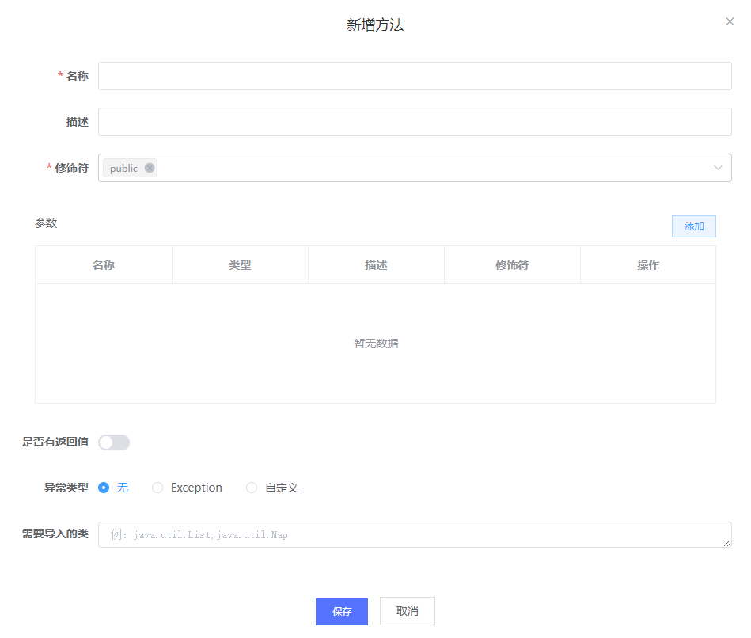

#### mapper

Mybatis的映射文件

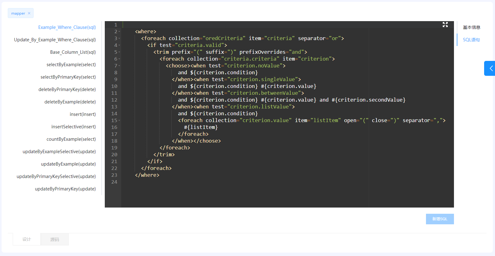

#### service

业务接口

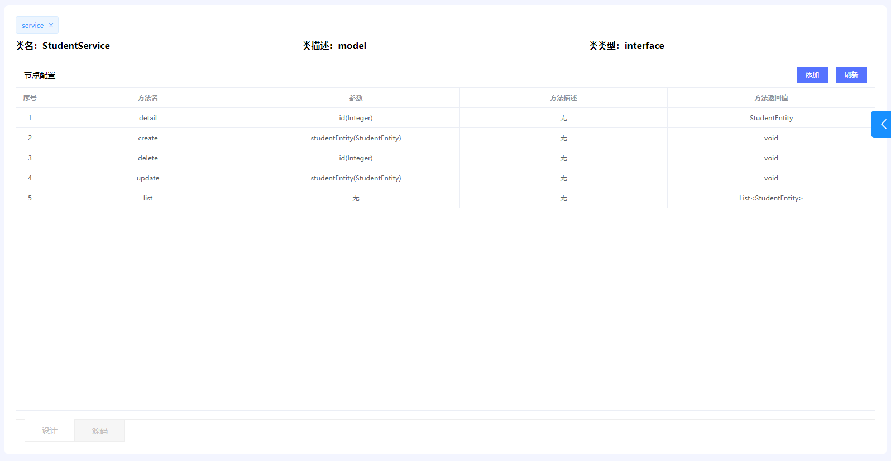

新增service接口

#### serviceImpl

业务接口实现

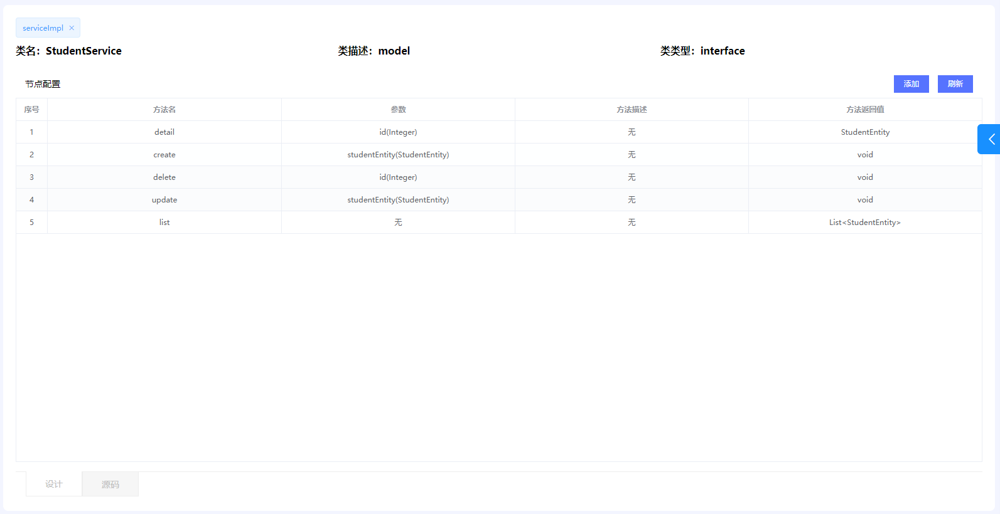
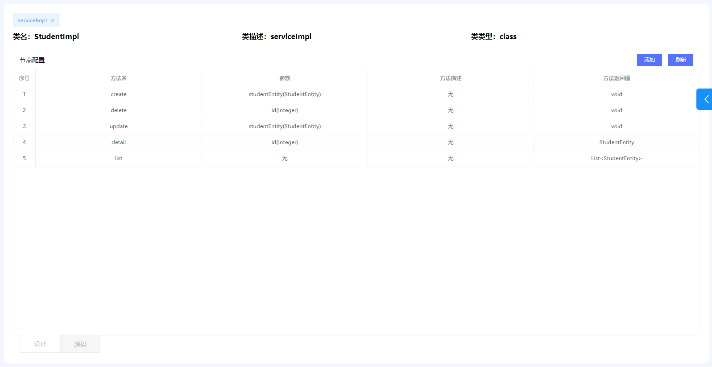

新增serviceImpl方法

	
	

#### controller
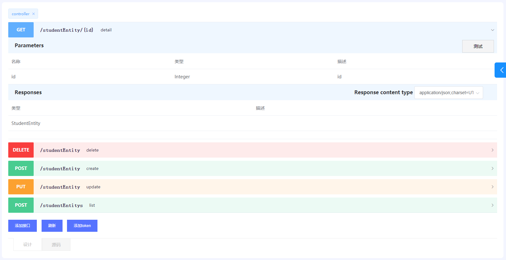
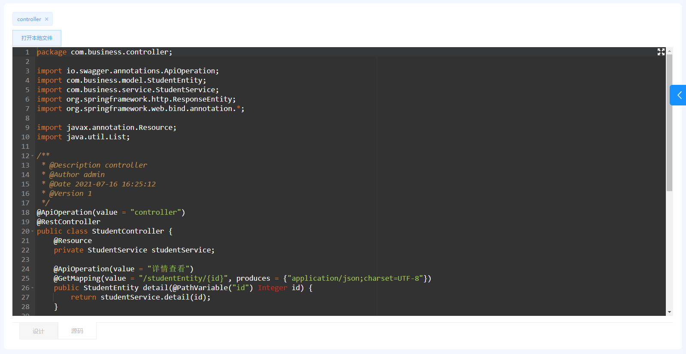

新增controller方法

	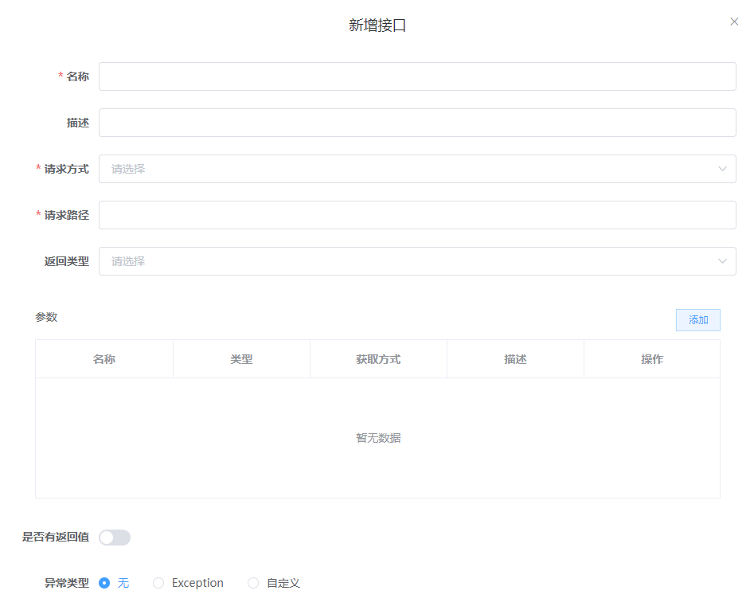
	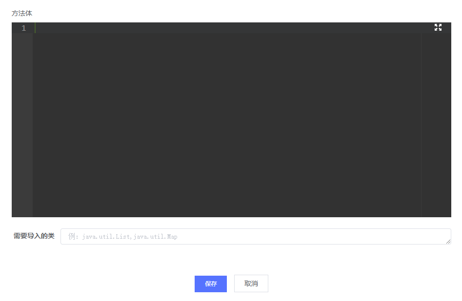

###### 接口测试

可以点击每个接口的测试按钮进行接口的调试

# 其他
## 个人配置

个人配置可以设置某个开发人员的独有配置，开发人员第一次进入项目前会先设置个人配置，之后使用过程中可以随时进行修改。

| 属性         | 描述                                                         | 必填 | 注意点 |
| ------------ | ------------------------------------------------------------ | ---- | ------ |
| 项目路径     | 开发人员本地的项目路径                                       | 是   |        |
| 使用已有项目 | 如果开启，会生成系统自带的项目，并覆盖当前项目路径下的所有文件 | 是   |        |
| 服务地址     | 用于测试后端接口                                             | 是   |        |
| 默认计划     | 设置个人的默认计划，具体可参照[计划]()                       | 是   |        |
| 作者         | 用于标识开发代码的作者                                       | 是   |        |

## 项目配置

整个项目的全局配置，一般有管理员操作，可参照[创建项目]()

## 重新初始化项目

可以重新创建系统自带的项目